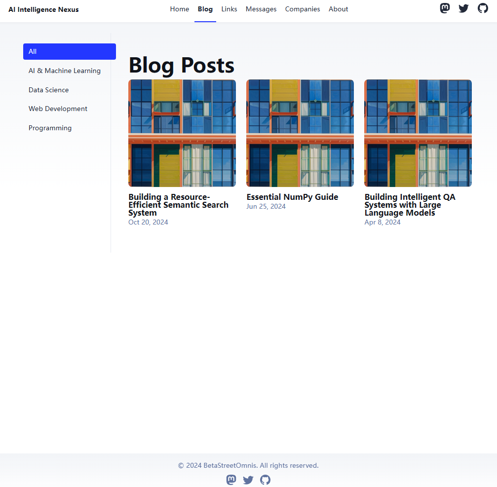
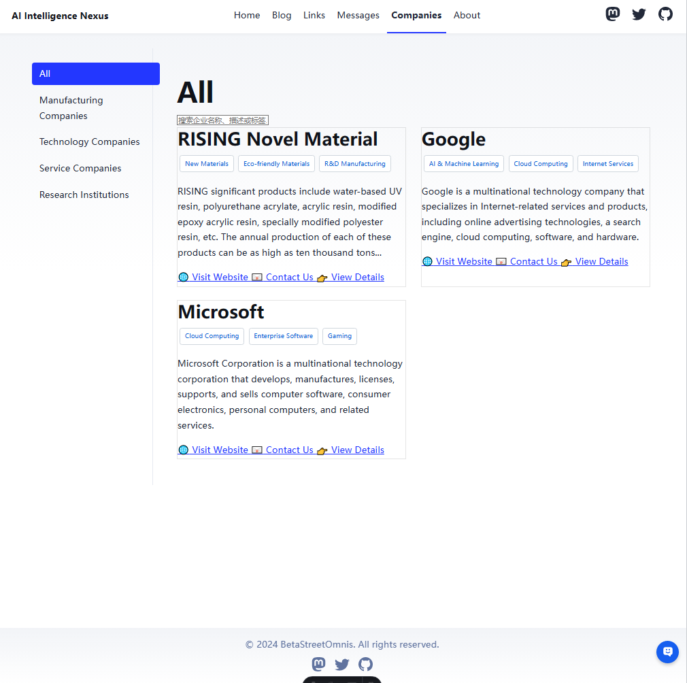
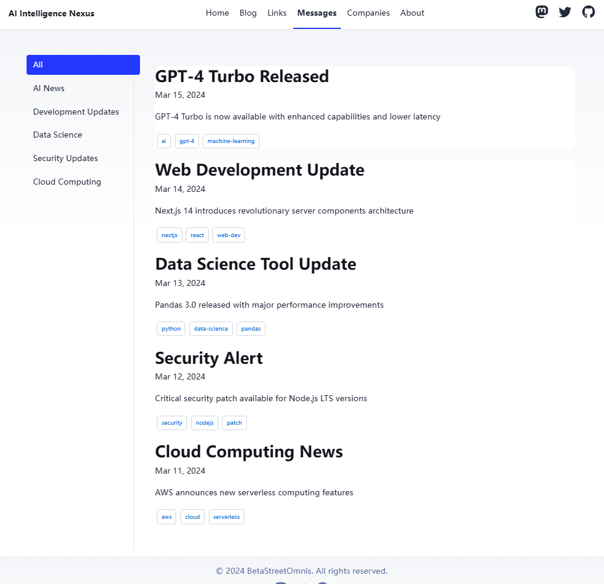
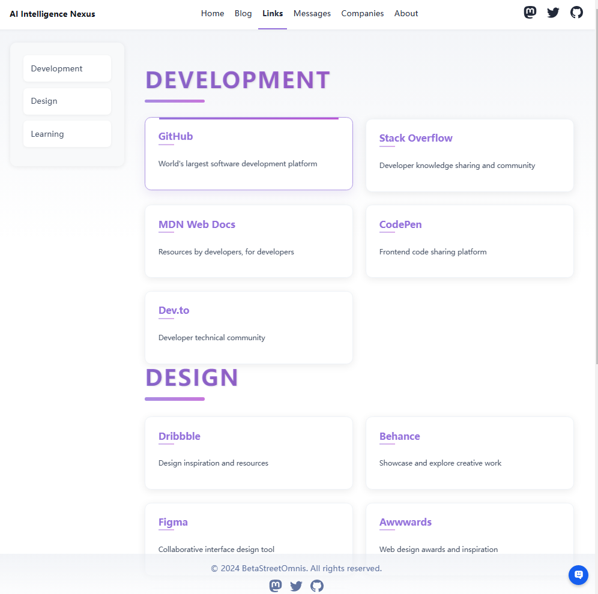

# AI Information Navigator

A comprehensive information platform built with Astro, featuring AI-related blogs, company profiles, tech news, and resource links.

> 🤖 **Welcome to AI Info Navigator!** A one-stop platform for AI-related information.

## 🎯 Project Purpose

This project was born out of a need for better navigation and organization of AI-related content. While exploring Astro templates, we found that existing solutions lacked proper navigation capabilities and blog categorization features. Most blog templates were either too simple or couldn't effectively categorize content. Therefore, we built and open-sourced this project to provide a comprehensive, well-organized platform for information.

## 📸 Screenshots

### Blog Navigation Page

### Company List Page

### Message Center

### Resource Links Page

Features:

- ✅ Multi-category content management (Blog, Companies, Messages, Links)
- ✅ Dynamic category-based filtering
- ✅ Company profiles with detailed information
- ✅ Latest AI news and tech updates
- ✅ Curated resource links collection
- ✅ SEO-friendly with canonical URLs and OpenGraph data
- ✅ Responsive design for all devices

## 🚀 Project Structure

Inside of the project, you'll see the following folders and files:
